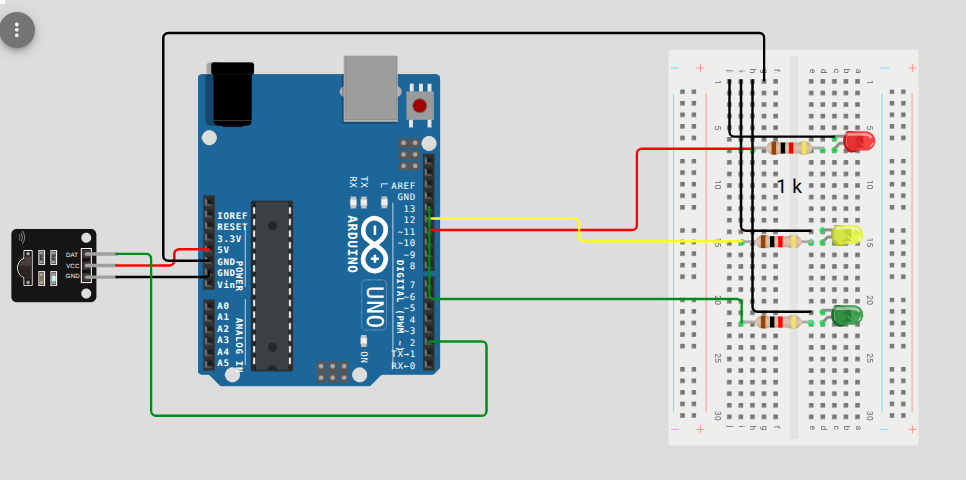

# IR Remote controlled LEDs

## Connections



## Code changes
Make changes to remote codes.

```c++
const IRMapping remoteMappings[] = {
  // NEC remote - 1
  // NOTE : Replace with your own remote codes !!!!
  // See code on your serial monitor
  { NEC, 0x80, 0x12, 0xFF },
  { NEC, 0x80, 0x07, led_pins[0] },  //  led 1
  { NEC, 0x80, 0x0A, led_pins[1] },  //  led 2
  { NEC, 0x80, 0x1B, led_pins[2] },  //  led 3
  { NEC, 0x80, 0x1F, led_pins[3] },  //  led 4

  // TV Remote
  { NEC, 0x04, 0x08, 0xFF },
  { NEC, 0x04, 0x56, led_pins[0] },  //  led 1
  { NEC, 0x04, 0x5C, led_pins[1] },  //  led 2
  { NEC, 0x04, 0xF7, led_pins[2] },  //  led 3
  { NEC, 0x04, 0x13, led_pins[3] },  //  led 4
};
```